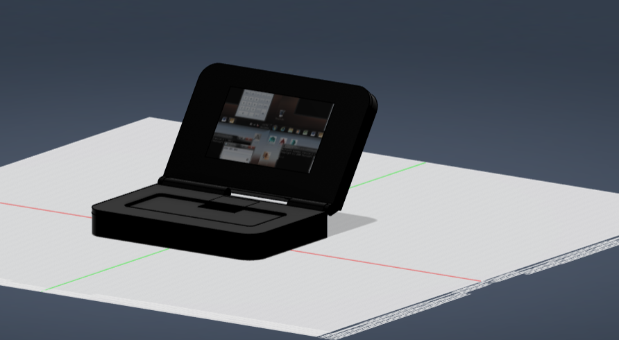

# Cyberx


## Project Overview
This cyberdeck is based on a **Raspberry Pi 4 (8 GB)** with an integrated battery backup, 10-inch display,keyboard, wireless mouse, USB expansion, and USB sound card.
It will run **Ubuntu** on it
---


## System Layout

```
Wall Power
     │
     ▼
 UPS HAT
     │
 LiPo Battery
     │
 Raspberry Pi 4
 ├── 10" HDMI Display
 ├── USB Hub
 │    ├── Keyboard Receiver / Bluetooth
 │    ├── Mouse Receiver
 │    └── USB Sound Card
 └── Wi-Fi / Bluetooth
```

---
**AED 1,009.75** **USD 270**


the case isnt fully accurate yet as aliexpress dosnt provide prpr dimensions 